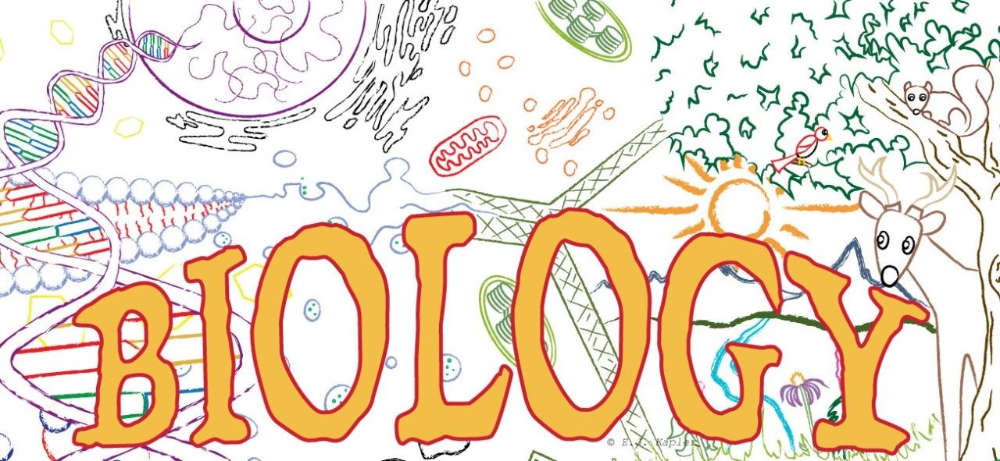

# Biology 生物

作者：娜娜

维护更新人员：

最近更新：

生物专业隶属于the Eberly College of Science。在宾州州立大学, 生物学有分六个选项：General Biology, Ecology, Genetics and Developmental Biology, Neuroscience, Plant Biology, 和Vertebrate Physiology。总体来说，选择生物专业具有广泛的就业方向。

## 未来就业方向

40%的毕业生选择 health care, 也就是医生，牙医，药学…等等。在PSU, 申请医学系的毕业生有大约80%会被录取。25%的毕业生会选择research, 10%的人选择教学，剩下的25%则往其他领域发展。

若你选择生物专业，**成为 LA \(Learning Assistant\)或 TA \(Teaching Assistant\)是非常建议的**，成为LA主要是在课堂上替学生解惑，也可以加深自己对课堂上内容的了解，至于成为TA，则主要是在实验室帮忙。不仅能得到学分，在简历上也有帮助，这也有助于决定未来的方向。

## PSU专业要求

通常会在大二时选择自己的专业，若要进生物专业，需要

1\) BIOL 110, MATH 140 or MATH 140B, CHEM 110 要拿C以上

2\) 需要再修BIOL 220W, BIOL 230W, BIOL 240W任何一个且要拿C以上

3\) 至少要有2.0的 GPA

在PSU的网站上，有非常清楚的选课建议及所有应必修的课。

参考网址：

[_http://bio.psu.edu/undergraduate-portal/our-curriculum_](http://bio.psu.edu/undergraduate-portal/our-curriculum)\_\_

网站上甚至还告诉你什么课上学期有，什么课下学期有。非常建议印下两种选课建议单，然后自己一次排好这四年各学期要修的课，之后再随之作微调。或者跟着建议的选课单走也行，但建议在各学期再加上一堂或两堂课，才会感觉比较充实：）

## 来自小编的建议

个人觉得若对生物或是有机化学没有太大的热忱的人并不适合读生物专业，因为在大三或大四时要接触的课程会更艰难更深入，幸好在400 level的课程中可以选择自己有兴趣的课来上，像我个人非常讨厌昆虫，于是把所有有关于昆虫的课全部剔除，然后选择有兴趣的课。对我来说，读生物专业某层面来说会为未来感到迷惘，因为太广泛，而且美国对于外国学生的要求又偏高，费用也偏高，因此比较不容易进入医学，牙医，药学，等等的研究所。但也因为就业方向很广泛，可以有很多选择而不至于找不到方向。

