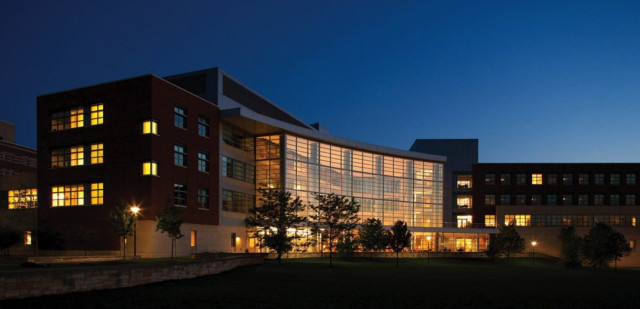

# Finance 金融

作者：单嘉敏

维护更新人员：

最近更新：

## **Smeal**商学院简介

作为容纳所有商科专业的教学楼，Smeal Business Building有着毫不逊色的颜值，宽敞的大厅是许多学生课余时间学习的场所，更是不少商科专属招聘会的举办地点。在Business Building内还有帮助商科学生求职提供宝贵机会和建议的Career Office（求职办公室），以及提供价值不菲的Bloomberg服务，帮助学生追踪市场动向的Rogers Family Trading Room。

[http://mbainsight.com/smeal-college-business-psu/](http://mbainsight.com/smeal-college-business-psu/)

## **选择金融**专业意味着什么？

 根据学院对金融专业的描述，金融专业将重点放在企业和个人如何募集资金和资本，以及如何将资源合理分配到不同的投资和消费机会上。

在本科阶段，金融专业注重给予学生一个学习金融各方面知识的机会，方向包括投资分析（investment analysis），银行及金融机构管理（management of banks and other financial institutions），企业金融管理（financial management of corporations），涵盖的话题包括商务金融（business finance），证券市场（security markets），商业银行管理（commercial bank management）等。如果以上这些有你喜欢的，那金融专业将会是一个很好的选择。

总体而言，金融是一个非常广泛的领域，选择金融专业可以让你为未来投身于银行，投资，保险，企业以及政府相关的职位做好准备。许多大公司，包括美国银行美林证券（Bank of America Merrill Lynch）安永（EY）都会在金融专业中寻找未来的雇员。

## **选课**以及建议

Finance的一大特点就是相对较高的GPA要求，如果想要正式成为Finance专业的学生，必须保证 entrance to major课程GPA在3.5以上。入专业有学分要求（credit window），修完的学分数量应在44到59之间。所以同学们要注意安排课表，一定要避免学分快要超过59了，却还没有修完entrance to major的课程。

学校为Fin学生推荐的课程安排可以在下面这个网站找到：

[http://rap.psu.edu/recommended-academic-plan-fin-university-park-program-year-2016](http://rap.psu.edu/recommended-academic-plan-fin-university-park-program-year-2016)

Finance的专业课一般涉及金融不同领域的话题，比如证券分析和证券投资组合管理（Fin 406），跨国金融管理（Fin 407），以及金融市场和机构（Fin 408）。

许多Finance专业的人都额外修了经济或者数学专业，同学们如果有兴趣并且学有余力。可以了解一下其他的专业，如果能够与金融相辅相成，那对各位的未来一定颇有益处。

### **作者个人理解**

Finance专业本身并不难，但其专业性质缺乏高技术壁垒以及硬性实力（如Computer Science学生所具备的编程技巧），如果想要在金融领域做出一番成就，课外的努力，包括学习其他可能用到的知识，提升交流技巧，建立对市场的认识等，都是必不可少的。**（仅供参考！）**

